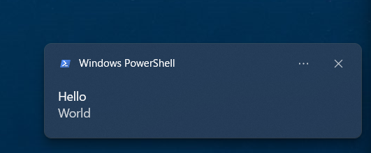

# Notify Server

リクエストを受け取ると、内容をデスクトップに通知する


## Usage

```text
Usage: notify-server.exe [PORT]

Arguments:
  [PORT]  The port to listen on [default: 12413]

Options:
  -h, --help     Print help
  -V, --version  Print version
```

## Request

```terminal
$ curl -G http://localhost:12413/ --data-urlencode "summary=Hello" --data-urlencode "body=World"
```


